# Ancient DNA Lactase Persistence Spatial Model

Extended Markdown specification for a Wolfram Language project that moves from raw ancient DNA genotype data through statistical inference and spatial modelling to a calibrated animation with explicit uncertainty.

Repository target: `mthiel74/ancient-dna-lactase-spatial-wolfram`

## Results at a Glance

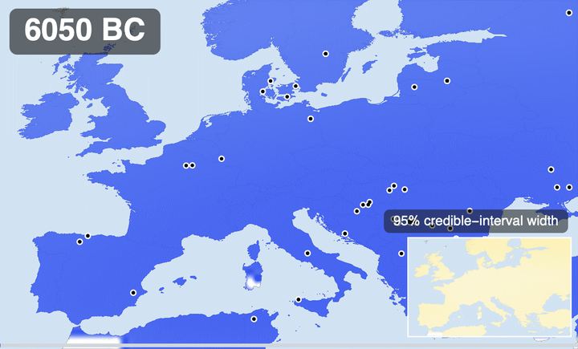

*The hero time-lapse: kriged posterior mean rs4988235-derived allele frequency over a landmasked 2-degree grid, 8000 BP to the present in 100-year interpolated steps, with the ancient samples of each moving window, a 95% credible-interval inset, and a progress bar. H.264 video: [hero_lactase_persistence.mp4](figures/generated/hero_lactase_persistence.mp4).*

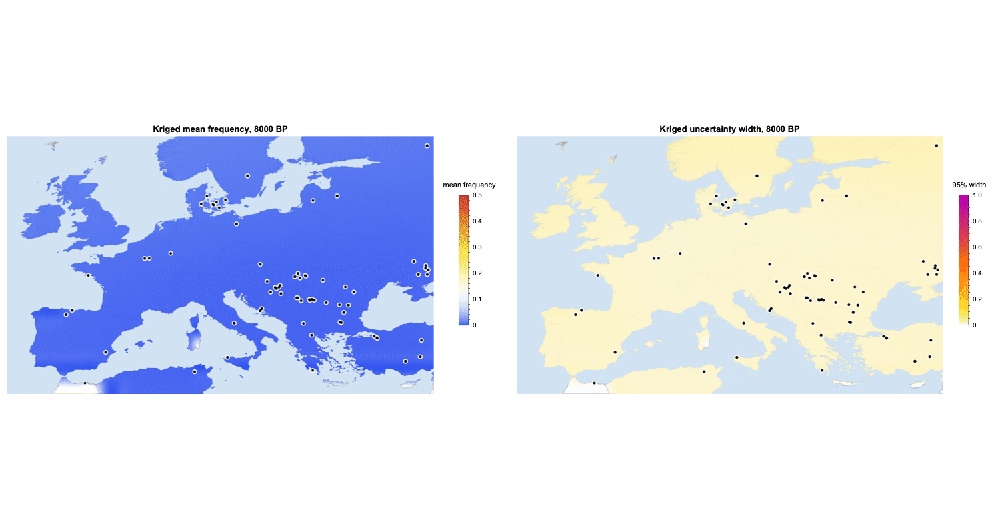

*The calibrated dual-panel version: posterior mean (left) and 95% credible-interval width (right) at equal rank, 500-year steps. H.264 video: [lactase_persistence_spatial_posterior.mp4](figures/generated/lactase_persistence_spatial_posterior.mp4).*

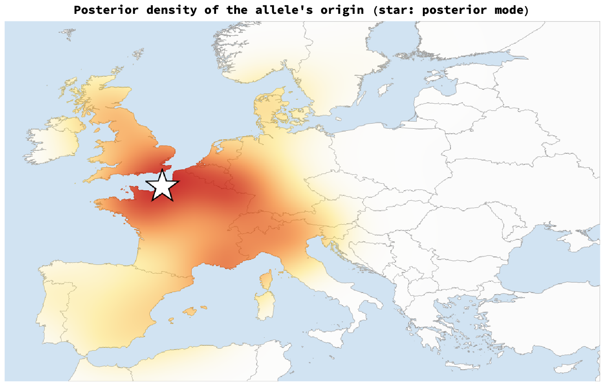

*The point-source origin model on the current AADR v66 data (10,119 ancient individuals, 5.7x the earlier GLAD extract), fitted with the same SMC-ABC plus a fitted gene-culture lead time and an explicit genotype-error channel (G-to-A is the transition post-mortem damage fakes): weighted posterior density of where the allele's selection-driven rise began (star: posterior mode - an unstable summary on a posterior this broad; read the spread). The origin date lands between the published anchors (median ~6,650 BP, leaning later than Itan et al.'s 7,441 toward the ~6,000 BP rise of Irving-Pease et al. 2024). The location is not identified, and to the extent it concentrates anywhere it leans toward the Atlantic side of Europe rather than the Carpathian Basin; section 11 of the notebook quantifies this against the digitised Itan et al. 2009 posterior, and the assumption-bridging experiments in `scripts/run_origin_bridge_experiments.wls` measure which Itan-like assumption buys back how much eastward movement.*

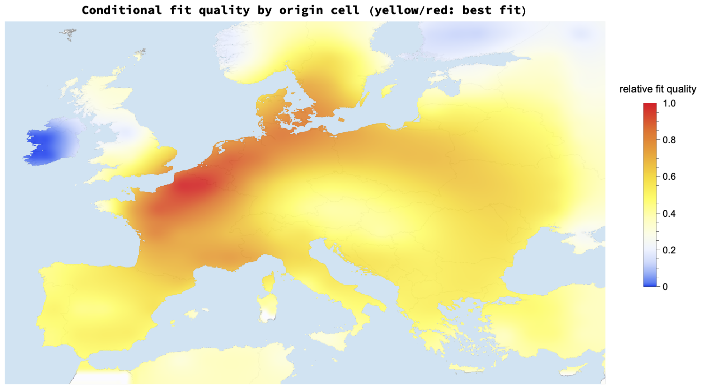

*Prior-free cross-check: non-origin parameters pinned at posterior medians, the point source moved through every land cell, coloured by fit to the ancient samples. The data alone prefer a broad northern-central band (latitude far better constrained than longitude); Iberia, the southern Balkans and Ireland are ruled out.*

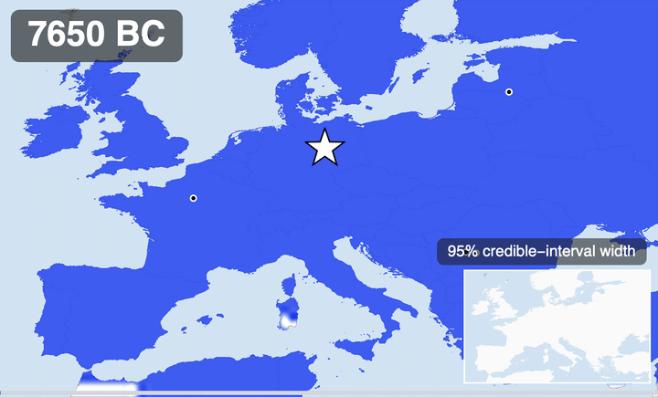

*Forward simulation from the fitted origin: the travelling wave, 9600 BP to the present (star: posterior modal origin). H.264 video: [origin_spread.mp4](figures/generated/origin_spread.mp4).*

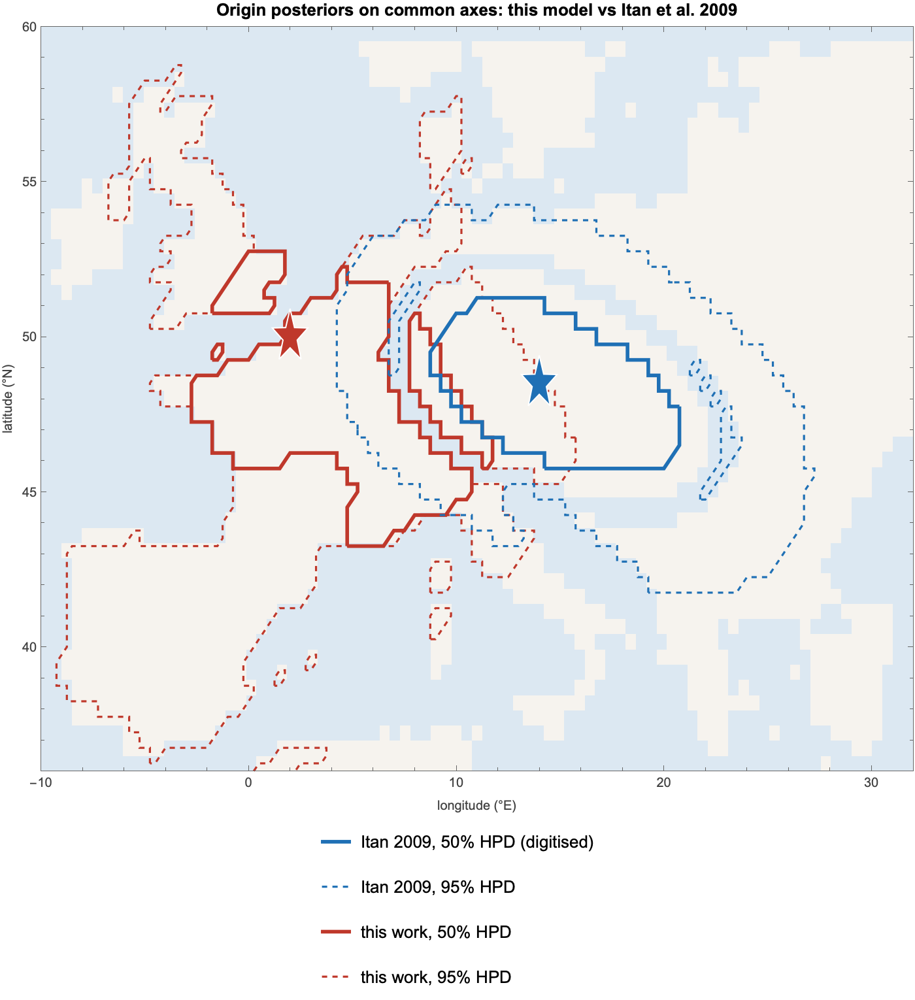

*The quantitative comparison, on common axes, now generated natively in Wolfram inside the notebook: `ImportItanFig3Density` digitises Itan et al. 2009's Fig 3 back into a numeric field (georeferenced from the figure's own axis ticks; an independent Python implementation in `scripts/digitise_itan_fig3.py` agrees to a mean absolute difference of 0.002), and `OriginItanHPDComparisonMap` draws both HPD contour sets. The 48.5N/14E "Itan mode" is the mode of our digitisation - their text localises the origin only qualitatively. The verdict, measured against the constrained prior that is the only fair baseline (section 11): **the origin date tracks the archaeology-driven prior rather than the genetics; total selection strength is a modest genuine finding (the weak tail is excluded); location is not identified** - the one real update is westward (mass west of 5E doubles from the prior's 27% to ~58%, +/-8% Monte Carlo), which must be read alongside unremoved westward biases, and the Carpathian box is genuinely undetermined (prior 3.4%, posterior bounded only below ~8% at ESS 36). The overlap statistics are computed live in the notebook with Monte Carlo error acknowledged (the SMC effective sample sizes are small, and every overlap number inherits that).*

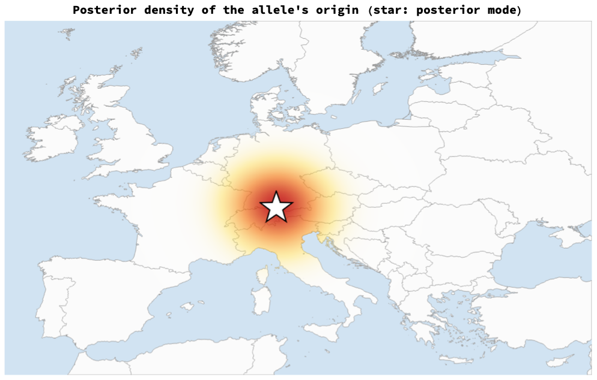

*v3 - the exact likelihood. The simulator is deterministic and every ancient individual is a binomial draw from the simulated frequency at its own cell and date, so the likelihood is exact and costs one forward run (0.05 s): `LikelihoodIndex` + `SampleLogLikelihood`, sampled by adaptive Metropolis MCMC (`RunMCMC`, `LoadOrRunOriginMCMC`; 3 chains x 30,000 iterations). No summary statistics, no tolerance schedule, no importance-weight degeneracy. The point-source posterior collapses from the ABC cloud onto the Alpine foreland (chains at 48.0N/10.4E, 45.3N/9.6E, 44.7N/10.2E; T ~ 9,300 BP) - and it does so while pushing Migration, DairyingLeadYears and OriginTimeBP onto their prior bounds and with split-Rhat of 2-7 on the selection multipliers. The map is what a misspecified model does when it is forced to be sharp, not a discovery; see the next figure.*

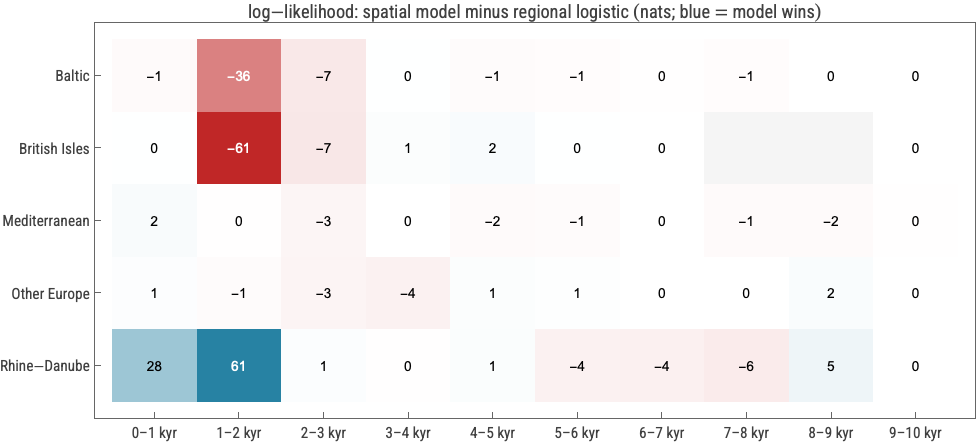

*The deviance ladder on the same 6,184 in-era samples (`DevianceLadder`): constant frequency -3891 (1 parameter); five independent regional logistic curves -2756 (10); **spatial standing-variation model (allele everywhere at 10 kyr BP, smooth gradient) -2695 (11)**; spatial point-source model -2796 (13); saturated -2185 (1,051 occupied time x cell bins). A single origin plus a diffusion wave is a worse description of these data than five unrelated curves, and ~100 nats worse than standing variation with two fewer parameters. The heat map (`LikelihoodResidualTable`, `ResidualHeatmap`) shows where: the wave wins +82 nats in Rhine-Danube (3,300+ samples resolve real within-region structure) and loses -64 in the British Isles and -47 in the Baltic, almost all at 1-2 kyr BP, where the model's continental-arrival gradient across Britain runs against samples in which the periphery is already high. A chain with diploid dominance h free (`DominanceGrowth`, `scripts/run_origin_mcmc_dominance.wls`) does not rescue the point-source model (MAP -2801.5 with 14 parameters) even though the data take the offered dominance (h ~ 0.98) - and it moves the origin to 53.0N/4.4E at ~7,560 BP: a location that jumps 500 km when the selection recursion changes is a property of the model, not of the allele. Section 12 of the notebook carries the full argument; the conclusion is that location is "identified" by the exact likelihood only inside a model the same likelihood rejects.*

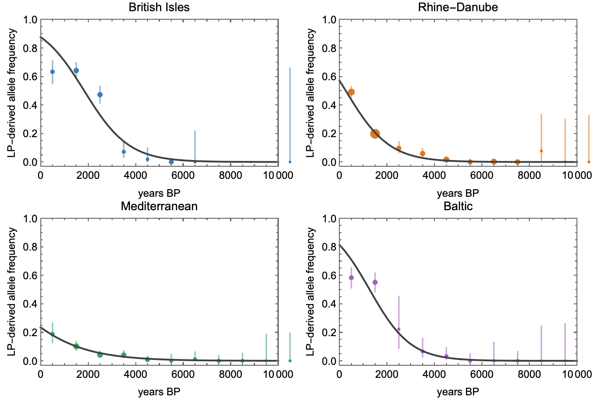

*Observed regional binned frequencies (points sized by called-allele count, 95% Wilson intervals) with fitted binomial logistic trajectories.*

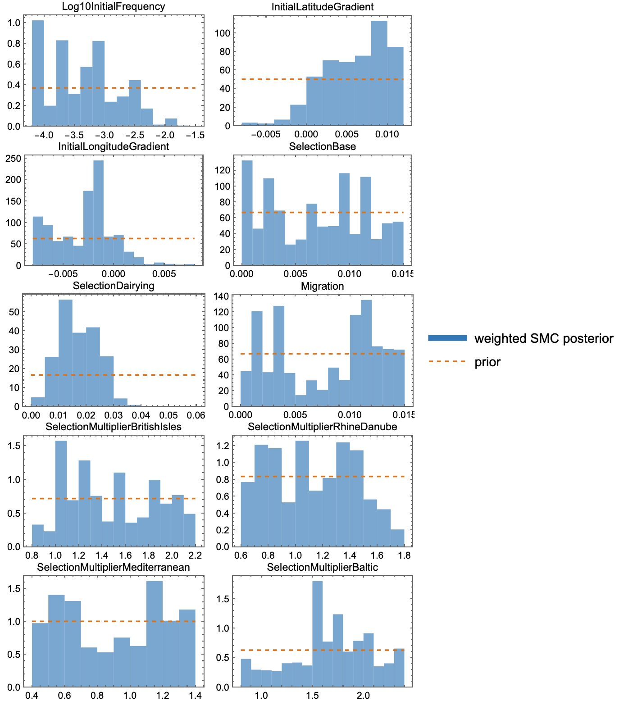

*Weighted SMC posterior (blue) against the flat prior (dashed orange) for all ten parameters; informed and prior-dominated dimensions are equally visible.*

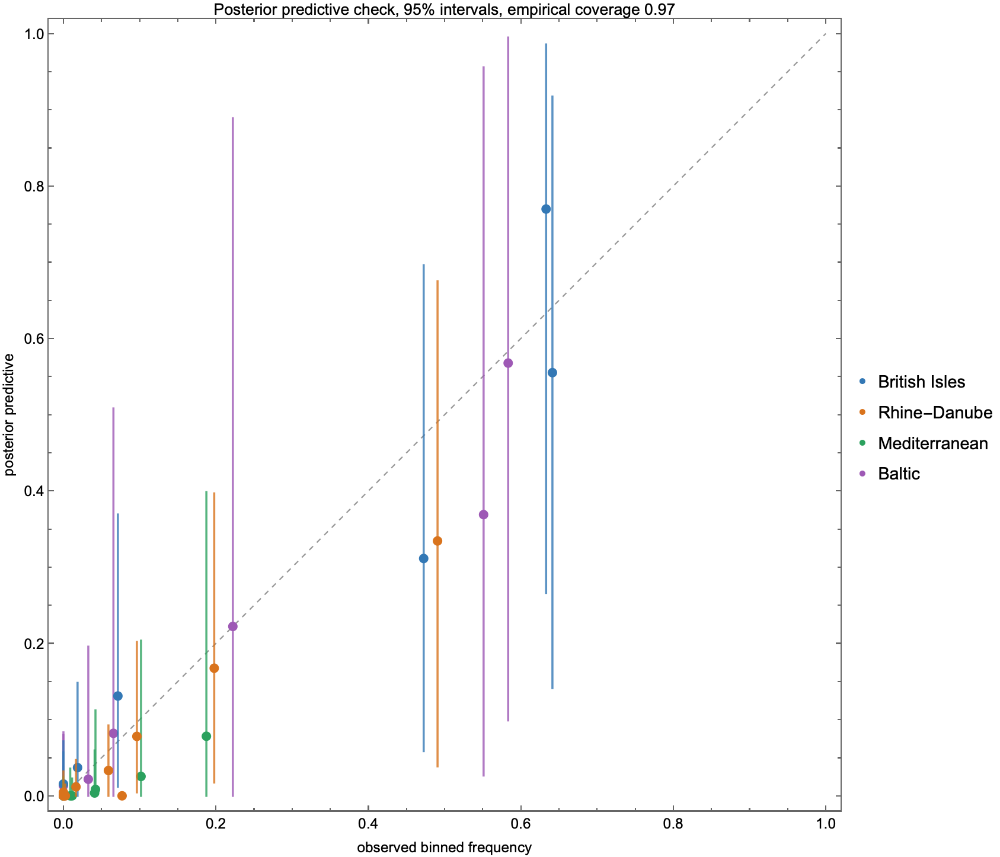

*Posterior predictive 95% intervals against the 37 observed regional time bins; empirical coverage 0.97.*

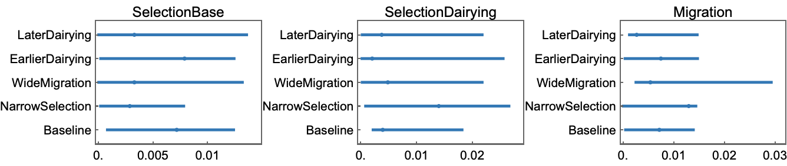

*Posterior medians and 95% intervals under five prior/onset scenarios: the dairying-modulated selection component stays positive throughout; migration tracks its prior.*

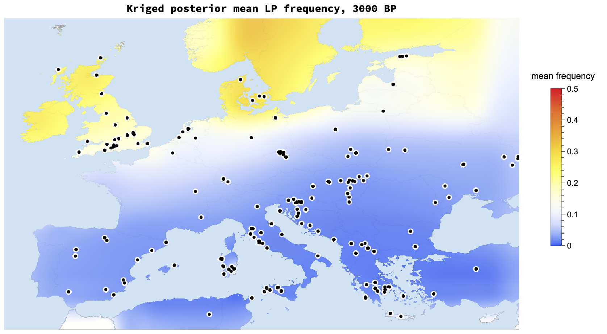

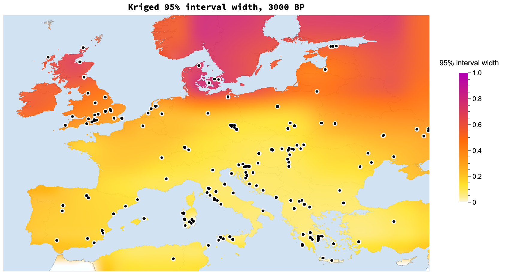

*Kriged posterior mean and uncertainty at 3000 BP; kriging is a display layer over the coarse 4-degree inference grid.*

The long-form Wolfram Community notebook (figures and animation embedded) is `community/ancient_dna_lactase_persistence.nb` with a PDF export beside it, rebuilt by `community/build_notebook.wls`; an interactive walkthrough of the pipeline is `notebooks/LactasePersistenceSpatial.nb`.

## Current Executable Baseline

This repository now contains a runnable Wolfram Language baseline for the full workflow:

- retrieve the public GLAD ancient `rs4988235` workbook derived from AADR v44.3
- normalize sample age, location, region, and genotype calls
- fit regional published-style logistic trajectories
- run a coarse Europe grid diffusion/selection spatial model
- fit the spatial model with SMC-ABC: adaptive tolerance schedule, Gaussian perturbation kernels, importance weights, and ESS tracking, using regional time-binned frequencies plus spatial-gradient summary statistics
- fit the same spatial models with the exact per-sample binomial likelihood by adaptive Metropolis MCMC (v3), with a deviance ladder against regional-logistic and saturated baselines, split-Rhat convergence diagnostics, and a region x millennium residual decomposition
- generate posterior predictive checks, held-out-region and held-out-time-slice validation, prior and dairying-onset sensitivity scenarios, kriged geographic maps, GIF animation, and MP4 video
- copy every generated animation/video version to Marco's iCloud Codex folder with timestamped filenames

The automated data source is the public GLAD LP Ancient Genotypes 2022 workbook used for the Evershed et al. 2022 lactase-persistence analysis. The original request named Allentoft et al. 2022; this implementation targets the public lactase-persistence genotype source that exposes the required `rs4988235` calls, ages, and coordinates.

## Quick Start

Run from the repository root:

```bash
wolframscript -file scripts/retrieve_data.wls
wolframscript -file scripts/run_pipeline.wls --particles 400 --generations 5 --cv-particles 150 --cv-generations 4
wolframscript -file scripts/run_origin_mcmc.wls 30000 10000        # exact-likelihood origin chain (~25 min)
wolframscript -file scripts/run_origin_mcmc_chain.wls 2718           # extra chains for split-Rhat
wolframscript -file scripts/run_origin_mcmc_chain.wls 1618
wolframscript -file scripts/run_main_mcmc.wls 314159                 # standing-variation model, exact likelihood
wolframscript -file scripts/run_main_mcmc.wls 2718
wolframscript -file scripts/export_v3_figures.wls                    # ladder, residuals, convergence, figures
wolframscript -file scripts/run_tests.wls
```

For a faster smoke run, lower `--particles`, `--generations`, and `--cv-particles`; pass `--sensitivity 0` to skip the sensitivity scenarios.

## Generated Outputs

The pipeline writes:

- raw immutable workbook and manifest under `data/raw/`
- processed sample tables, regional bins, weighted SMC particles, resampled posterior draws, SMC diagnostics (tolerance, acceptance, ESS per generation), posterior parameter quantiles, posterior predictive checks, held-out-region and time-slice validation, and sensitivity quantiles under `data/processed/`
- regional reproduction (with Wilson intervals), parameter posteriors with prior overlays, posterior predictive, sensitivity intervals, kriged spatial mean, kriged spatial uncertainty, GIF, and MP4 artifacts under `figures/generated/`
- run notes under `docs/run-summary.md`

Spatial maps are rendered as geographic objects with `GeoGraphics`, `GeoPosition`, and `GeoBackground -> "CountryBorders"`. The inferred model remains the coarse adjacency grid; ordinary kriging is used only as the display layer to make the geographic surface readable without claiming finer inferential resolution.

Animation outputs:

- repository GIF: `figures/generated/lactase_persistence_spatial_posterior.gif`
- repository MP4: `figures/generated/lactase_persistence_spatial_posterior.mp4`
- timestamped iCloud copies: `~/Library/Mobile Documents/com~apple~CloudDocs/Documents/Codex/YYYY-MM-DD_HHMMSS_lactase_persistence_spatial_posterior.{gif,mp4}`

## Project Goals

Build an end-to-end Wolfram Language pipeline for the evolution of lactase persistence in ancient European DNA:

- Ingest raw ancient DNA genotype data.
- Parse sample age, geographic location, region, and genotype at `rs4988235`.
- Reproduce the published non-spatial regional trajectory fits first.
- Extend the model to a spatial European grid or mesh.
- Fit selection, migration, and dairying-onset effects with transparent uncertainty.
- Generate calibrated figures and an animation that shows posterior mean frequency and uncertainty without fake precision.
- Package the result as reproducible notebooks, source code, tests, figures, and a Wolfram Community narrative post.

The initial scientific target is the Allentoft et al. 2022 dataset and supplement.

## Data Sources

Primary data target:

- Allentoft et al. 2022 ancient DNA dataset and supplementary material.
- Public repositories referenced by the study.
- Curated public mirrors only when the original source is unavailable or unsuitable for automated retrieval.

The pipeline must parse, at minimum:

- sample identifier
- sample age or calibrated date
- geographic location
- analysis region
- genotype at `rs4988235`
- missingness and genotype-call quality where available
- source file and extraction provenance

Raw data handling:

- Store raw files under `data/raw/`.
- Treat raw files as read-only after retrieval.
- Never overwrite raw files in place.
- Create processed versions under `data/processed/`.
- Attach provenance notes to every processed dataset, including retrieval date, source URL, checksum, parser version, and filtering decisions.

## Published Trajectory Reproduction

The first analysis milestone is to reproduce the published non-spatial regional fits from the 2022 study before adding spatial dynamics.

Required reproduction steps:

- Implement regional logistic fits matching the study's modelling assumptions as closely as possible.
- Bin or otherwise summarize observations through time by region in a way that is explicitly documented.
- Plot observed genotype frequencies through time by region.
- Overlay fitted logistic trajectories.
- Confirm qualitative agreement with the published figures before adding the spatial extension.

For a region `r`, a starting reproduction model may be written as:

```text
logit(p_r(t)) = alpha_r + beta_r t
```

where `p_r(t)` is the lactase-persistence allele or genotype frequency at time `t`. The final implementation should match the published study's parameterization wherever the paper and supplement provide enough detail.

## Spatial Extension

After the regional fits are reproduced, extend the model over Europe as a spatial domain.

Spatial representation:

- Use Europe as a 2D grid or mesh.
- Encode spatial adjacency for local diffusion, migration, or dispersal.
- Alternatively implement a kernel-based movement model if it is easier to calibrate and validate.
- Keep spatial resolution coarse enough that uncertainty is honest relative to the data density.

Core biological and cultural components:

- Let local lactase-persistence frequency evolve through selection and movement.
- Add regional dairying onset as a covariate that modulates the strength or timing of selection.
- Keep priors on selection anchored to the literature, with selection on the order of a few percent per generation.
- Keep migration or diffusion rates in a plausible Holocene European range and test sensitivity.

A minimal spatial dynamic can be expressed as:

```text
p_i(t + 1) = p_i(t) + selection_i(t) + migration_i(t)
```

with:

```text
selection_i(t) = s_i(t) p_i(t) (1 - p_i(t))
migration_i(t) = m sum_j A_ij (p_j(t) - p_i(t))
s_i(t) = s_0 + s_dairy D_i(t)
```

where `i` and `j` index grid cells, `A_ij` is spatial adjacency, `m` is a migration or diffusion parameter, `D_i(t)` is a dairying-onset covariate, and `s_i(t)` is the local selection coefficient.

Likelihood:

- Link each ancient sample to the closest or most appropriate grid cell.
- Evaluate the expected genotype probability at the sample's location and age.
- Account for genotype uncertainty or missingness where available.
- Avoid overconfident interpolation in regions and periods with sparse data.

## Inference Plan

Start with approximate Bayesian computation because it is robust for simulation-heavy models and can be implemented cleanly in Wolfram Language.

Initial ABC summary statistics:

- regional time-binned genotype or allele frequencies
- temporal slopes by region
- onset timing or midpoint estimates from logistic fits
- spatial gradients through time
- contrasts between dairying and non-dairying regions

Inference stages:

- Begin with rejection ABC to validate the simulator and summaries.
- Move to SMC-ABC if rejection ABC is too inefficient.
- Use simulation-based inference if compute resources and tooling allow.
- Track tolerances, retained particles, summary distances, and effective sample sizes.

Priors:

- Selection coefficients: anchored to published lactase-persistence estimates, roughly a few percent per generation.
- Migration or diffusion: plausible for Holocene Europe, with broad sensitivity checks.
- Dairying effect: weakly informative, allowing no effect through strong modulation.
- Regional initial conditions: constrained by early observed ancient DNA where possible.

Sensitivity:

- Re-run fits under wider and narrower selection priors.
- Test alternative migration priors.
- Test alternative dairying-onset encodings.
- Report which scientific conclusions are robust and which are prior-sensitive.

## Validation

Use posterior predictive checks and cross-validation before presenting the spatial extension as scientifically meaningful.

Validation tasks:

- Hold out regions and predict their time trajectories.
- Hold out time slices and predict observed frequencies.
- Compare observed values to posterior predictive distributions.
- Plot calibration diagnostics, not only posterior means.
- Quantify uncertainty in both space and time.

Required validation figures:

- observed versus posterior predictive regional frequencies
- held-out region/time-slice predictive checks
- posterior distributions for core parameters
- sensitivity comparison across prior choices
- map panels showing posterior uncertainty, not just posterior mean

## Visualization And Animation

Use Wolfram Language visualization tools throughout.

Required tools:

- `GeoGraphics` for spatial maps and sample locations.
- `GeoListPlot` for exploratory sample-location checks where useful.
- Ordinary kriging for the exported geographic display surface, with the coarse grid retained as the inferential unit.
- `ListAnimate` or exported animation frames for temporal dynamics.
- Standard plotting functions for regional reproduction and diagnostics.

Animation requirements:

- Render posterior mean lactase-persistence frequency over time.
- Add an explicit uncertainty layer, such as credible interval width, opacity, hatching, or separate panels.
- Show ancient sample locations used in each time window.
- Avoid blob visuals and fake precision.
- Use a spatial resolution that reflects data density and posterior uncertainty.
- Include clear legends, time labels, and uncertainty explanations.

## Testing And Continuous Integration

Use Wolfram Language tests with `VerificationTest`.

Test coverage must include:

- data retrieval metadata parsing
- genotype parsing at `rs4988235`
- age and location normalization
- regional assignment
- logistic-model helper functions
- spatial adjacency or kernel construction
- simulator update rules
- likelihood evaluation
- ABC distance calculations
- visualization helper functions that prepare map layers and animation frames

Tests run locally with `wolframscript -file scripts/run_tests.wls` (27 VerificationTests, small fixtures under `tests/fixtures/`); there is no hosted CI.

## Repository Structure

Use this structure:

```text
data/
  raw/
  processed/
notebooks/
src/
tests/
figures/
community/
docs/
```

Folder roles:

- `data/raw/`: raw downloaded source files, treated as immutable and read-only.
- `data/processed/`: cleaned and derived datasets with provenance notes.
- `notebooks/`: Wolfram notebooks and Wolfram scripts for data retrieval, exploration, fitting, validation, and animation.
- `src/`: reusable Wolfram Language package code.
- `tests/`: `VerificationTest` files and small fixtures.
- `figures/`: generated plots, maps, and animation frames.
- `community/`: the buildable Wolfram Community notebook (`build_notebook.wls`), the built `.nb`, and its PDF export.
- `docs/`: narrative notes, Wolfram Community post draft, and exported documentation assets.

## Data Retrieval Notebook

Provide a retrieval notebook that:

- lists the authoritative source URLs
- downloads raw source files into `data/raw/`
- records checksums
- sets raw files to read-only after retrieval
- writes a retrieval manifest
- documents any manual intervention or mirror fallback
- creates no processed files directly, except metadata needed for provenance

The retrieval notebook should be reproducible but must not silently overwrite existing raw data.

## Wolfram Community Deliverable

Prepare a narrative Wolfram Community post inspired by the structure of the ENSO article:

- introduction
- data and methods
- model description with clean math
- reproduction of published non-spatial results
- spatial extension
- results
- uncertainty discussion
- validation and posterior predictive checks
- GitHub link
- downloadable notebooks
- calibrated animation with uncertainty explicitly shown

The post should be written for readers who can follow Wolfram Language code and mathematical modelling, while still making the archaeological genetics motivation clear.

## Definition Of Done

The project is done when:

- the end-to-end pipeline runs from data retrieval through figures and animation
- raw data are preserved read-only and processed data include provenance
- published regional trajectories are reproduced qualitatively
- a spatial extension is fitted to ancient genotype observations
- posterior uncertainty is quantified across space and time
- hold-out validation has been run for regions or time slices
- posterior predictive checks are plotted
- sensitivity to priors is documented
- a calibrated animation is generated with uncertainty explicitly shown
- the Wolfram Community narrative post and downloadable notebooks are ready

## Licence

Code (package, scripts, tests): [MIT](LICENSE). Text, figures, and the
notebook: [CC BY 4.0](https://creativecommons.org/licenses/by/4.0/)
(attribution: Marco Thiel, link to this repository). Third-party data terms:
see [DATA_LICENCES.md](DATA_LICENCES.md).
